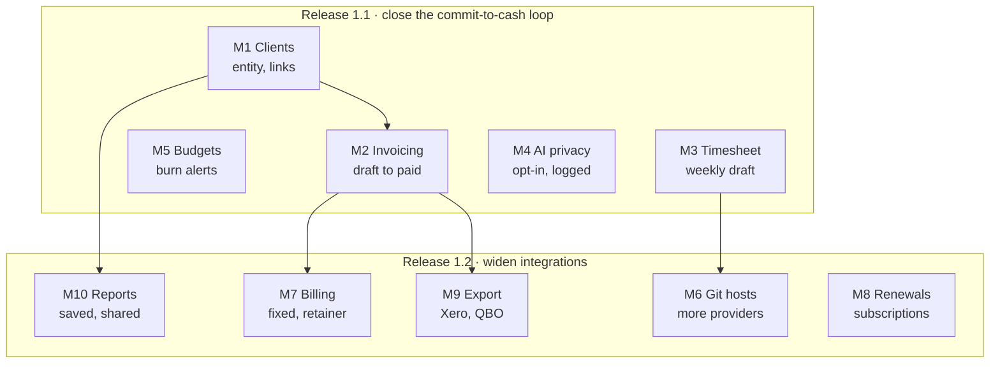

# Desk (Laravel) — Milestones

29 Sep 2026 · D.L.

Ten milestones in two releases: 1.1 closes the commit-to-cash loop, 1.2 widens integrations. Tests for each milestone are in `TEST-CHECKLIST.md`.

## Milestone order

Build M1 and M2 first; M3, M4 and M5 are independent and can fill gaps while invoicing is in review. In 1.2, only M6 and M8 can start before invoicing is stable.

## M1 · Clients (release 1.1, size S)

Clients become a first-class record so invoices, reports and share links have someone to belong to.

**Deliverables**

- `clients` table: UUID, auto code `CLT-00001`, name, billing email, address, company registration or tax ID (optional), currency, default hourly rate, status, notes
- Nullable `client_id` on projects and transactions; CRUD screens; client detail page with its projects, transactions and documents
- Documents attachable to a client
- CSV import with the usual template, preview and commit flow

**Decision before building:** rate precedence. Today a project with no rate bills at 0. Proposed: project rate, then client rate, then the system default.

## M2 · Invoicing (release 1.1, size M)

Time and fixed lines become an invoice, and a paid invoice posts its own income transaction.

**Deliverables**

- `invoices` and `invoice_lines`; statuses draft, issued, paid, void
- Invoice number `INV-YYYY-00001`, assigned at issue rather than at draft so the sequence has no gaps
- Build from unbilled billable time entries (one line per entry or grouped by stage) plus manual lines
- GST per line from a system rate; settings for GST registration number, payment terms and invoice footer
- Branded PDF (Montserrat) stored on S3 as a document linked to the invoice; email with the PDF attached
- Record payment: marks paid and creates one income transaction (in, completed, amount and GST split, linked to invoice, project and client)
- Void: releases the time entries and records the reason
- Dashboard card for outstanding receivables; bot endpoint `GET /api/bot/invoices/summary`

## M3 · Weekly draft timesheet (release 1.1, size S)

One screen per week turns every pending commit into time entries in a couple of minutes.

**Deliverables**

- Week view (Monday to Sunday in the system timezone) of pending commits across all projects, grouped by day and project, with suggested stage, summary and 15-minute duration
- Bulk convert, bulk squash, and dismiss or restore a commit
- Week total against an optional weekly target
- Scheduled reminder when pending commits exist; bot endpoint `GET /api/bot/timesheet/pending`

## M4 · AI privacy controls (release 1.1, size S)

AI is off until switched on, works with any provider, and logs exactly what left the server.

**Deliverables**

- `ai.enabled` setting, default off; drivers for null, OpenAI, Anthropic and any OpenAI-compatible local endpoint; model configurable
- Payload allow-list: commit message, branch, changed-file count, stage names and keywords. Never diffs or author emails; file paths behind a toggle
- Redaction of token-like strings and email addresses before sending
- Per-project opt-out
- `ai_requests` log: time, provider, model, purpose, payload hash and length, outcome; a prune command for retention

## M5 · Budgets and burn alerts (release 1.1, size S)

Each project can carry an hours or money budget and warns once at each threshold.

**Deliverables**

- Project budget type (none, hours, amount), budget value, thresholds defaulting to 50, 80 and 100%
- Progress bar on the project page; "at risk" list on the dashboard
- `budget_alerts` table so each threshold fires once; alerts re-arm only when the budget value changes
- Alerts by email and through bot endpoint `GET /api/bot/budgets/alerts`, so the Telegram assistant can push them

## M6 · More Git providers (release 1.2, size M)

GitHub moves behind one provider interface, and GitLab and Bitbucket plug into it.

**Deliverables**

- `SourceProvider` interface: OAuth connect, list repos and branches, register and remove webhook, verify request, parse a push into normalised commits
- GitHub refactored onto it first; then GitLab and Bitbucket Cloud
- Webhook route `/webhooks/{provider}/{project}`, each using that provider's own signature or secret-token check

## M7 · Billing models (release 1.2, size M)

Projects can be hourly, fixed-fee with milestones, or a monthly retainer.

**Deliverables**

- Project billing model: hourly (default), fixed fee (total plus milestones), retainer (monthly amount, included hours, overage rate, rollover on or off)
- `milestones` table: name, amount, due date, status; a milestone becomes an invoice line
- Scheduled command drafts each retainer's monthly invoice, including overage lines

**Decision before building:** on fixed-fee projects, should time entries carry a billable amount? Proposed: no — track hours as effort only, so margin shows fee against time spent.

## M8 · Renewals and recurring charges (release 1.2, size S)

Services know what they cost and when they renew, so SaaS spend stops being a surprise.

**Deliverables**

- On services: billing cycle (monthly, yearly), expected amount, currency, next renewal date, account, payment method, and an "auto-create pending expense" toggle
- Scheduled command creates the pending expense on the renewal date and advances the date
- Reminder a set number of days before renewal; dashboard list of renewals in the next 30 days
- Spend report per vendor and category

## M9 · Accounting export (release 1.2, size M)

Your accountant gets invoices, expenses and contacts in the import format of Xero or QuickBooks Online.

**Deliverables**

- CSV exports matching each tool's own import templates for invoices, expenses or bills, and contacts
- Mapping settings: Desk categories to chart-of-accounts codes, GST to tax codes
- Export batches recorded so rows aren't exported twice; API sync can come later

## M10 · Saved reports and client share links (release 1.2, size M)

Reports can be saved, emailed on a schedule, and shared read-only with a client, with no client login.

**Deliverables**

- Saved report presets with relative ranges (this month, last month, this quarter)
- Scheduled delivery, weekly or monthly, as PDF or CSV
- Client share link: tokenised, read-only, scoped to one client's projects, hours and invoices; expiry, revoke, optional passcode, view log (the same pattern as Skylight's share links)

## Deferred

These items stay out of the Laravel roadmap:

- **Multi-user, roles, approvals, SSO.** They belong in the Spring edition, where tenancy is designed in from the start.
- **InvoiceNow (Peppol) sending.** Needed before the 2028–2031 deadlines. Easier once M2 invoices are stable.
- **Partial payments, receipt OCR, and bank statement matching.**